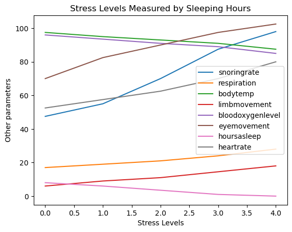
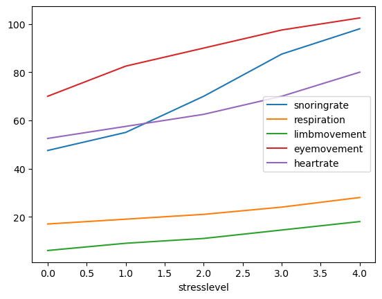
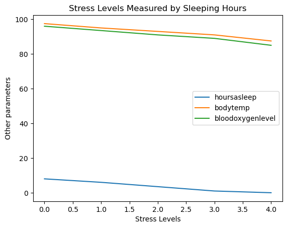
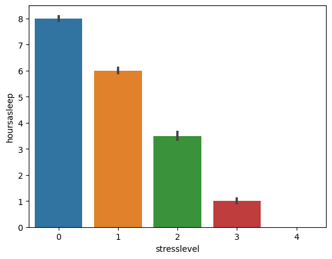

# Data Visualization Project for Kaggle trial

### Some Useful tips

%lsmagic - to see all bash and other magic commands\n
%inlinematplotlib  - run if you want to be able to display matplotlib graphs inline\n
%%HTML - converts the cell to render HTML (use to embed videos/display some website content)
%%timeit - times some python code that you may write and gives avg time
 
Use File -> Download as to pick the format in which you would like the file to be presented/shared

## Working with the Human Stress Detection in and through Sleep Data from Kaggle
[Find more details here](https://www.kaggle.com/datasets/laavanya/human-stress-detection-in-and-through-sleep)
#### README (for the data)

##### Columns: 
1. snoring range of the user
2. respiration rate
3. body temperature
4. limb movement rate
5. blood oxygen levels
6. eye movement
7. number of hours of sleep
8. heart rate
9. Stress Levels (0- low/normal, 1 – medium low, 2- medium, 3-medium high, 4 -high) 

Considering today’s lifestyle, people just sleep forgetting the benefits sleep provides to the human body. Smart-Yoga Pillow (SaYoPillow) is proposed to help in understanding the relationship between stress and sleep and to fully materialize the idea of “Smart-Sleeping” by proposing an edge device. An edge processor with a model analyzing the physiological changes that occur during sleep along with the sleeping habits is proposed. Based on these changes during sleep, stress prediction for the following day is proposed. The secure transfer of the analyzed stress data along with the average physiological changes to the IoT cloud for storage is implemented. A secure transfer of any data from the cloud to any third-party applications is also proposed. A user interface is provided allowing the user to control the data accessibility and visibility. SaYoPillow is novel, with security features as well as consideration of sleeping habits for stress reduction, with an accuracy of up to 96%.
In SayoPillow.csv, you will see the relationship between the parameters- snoring range of the user, respiration rate, body temperature, limb movement rate, blood oxygen levels, eye movement, number of hours of sleep, heart rate and Stress Levels (0- low/normal, 1 – medium low, 2- medium, 3-medium high, 4 -high) 

#### Sources:
1.	L. Rachakonda, A. K. Bapatla, S. P. Mohanty, and E. Kougianos, “SaYoPillow: Blockchain-Integrated Privacy-Assured IoMT Framework for Stress Management Considering Sleeping Habits”, IEEE Transactions on Consumer Electronics (TCE), Vol. 67, No. 1, Feb 2021, pp. 20-29.
2.	L. Rachakonda, S. P. Mohanty, E. Kougianos, K. Karunakaran, and M. Ganapathiraju, “Smart-Pillow: An IoT based Device for Stress Detection Considering Sleeping Habits”, in Proceedings of the 4th IEEE International Symposium on Smart Electronic Systems (iSES), 2018, pp. 161--166. 


```python
print("hello")
```

    hello
    


```python
# Importing the libraries
import pandas as pd
import numpy as np
import datetime as dt
import matplotlib.pyplot as plt
import seaborn as sns
import numpy as np

"Libraries Imported"
```


    'Libraries Imported'


```python
#Load the data
data = pd.read_csv("StressSleepData.csv")
data.head()
```


<div>
<style scoped>
    .dataframe tbody tr th:only-of-type {
        vertical-align: middle;
    }

    .dataframe tbody tr th {
        vertical-align: top;
    }

    .dataframe thead th {
        text-align: right;
    }
</style>
<table border="1" class="dataframe">
  <thead>
    <tr style="text-align: right;">
      <th></th>
      <th>sr</th>
      <th>rr</th>
      <th>t</th>
      <th>lm</th>
      <th>bo</th>
      <th>rem</th>
      <th>sr.1</th>
      <th>hr</th>
      <th>sl</th>
    </tr>
  </thead>
  <tbody>
    <tr>
      <th>0</th>
      <td>93.80</td>
      <td>25.680</td>
      <td>91.840</td>
      <td>16.600</td>
      <td>89.840</td>
      <td>99.60</td>
      <td>1.840</td>
      <td>74.20</td>
      <td>3</td>
    </tr>
    <tr>
      <th>1</th>
      <td>91.64</td>
      <td>25.104</td>
      <td>91.552</td>
      <td>15.880</td>
      <td>89.552</td>
      <td>98.88</td>
      <td>1.552</td>
      <td>72.76</td>
      <td>3</td>
    </tr>
    <tr>
      <th>2</th>
      <td>60.00</td>
      <td>20.000</td>
      <td>96.000</td>
      <td>10.000</td>
      <td>95.000</td>
      <td>85.00</td>
      <td>7.000</td>
      <td>60.00</td>
      <td>1</td>
    </tr>
    <tr>
      <th>3</th>
      <td>85.76</td>
      <td>23.536</td>
      <td>90.768</td>
      <td>13.920</td>
      <td>88.768</td>
      <td>96.92</td>
      <td>0.768</td>
      <td>68.84</td>
      <td>3</td>
    </tr>
    <tr>
      <th>4</th>
      <td>48.12</td>
      <td>17.248</td>
      <td>97.872</td>
      <td>6.496</td>
      <td>96.248</td>
      <td>72.48</td>
      <td>8.248</td>
      <td>53.12</td>
      <td>0</td>
    </tr>
  </tbody>
</table>
</div>


```python
# Change col names to make it more obvious

new_column_names = ["snoringrate", "respiration", "bodytemp", "limbmovement", "bloodoxygenlevel", "eyemovement", "hoursasleep", "heartrate", "stresslevel"]
data.columns = new_column_names
data.head()
```


<div>
<style scoped>
    .dataframe tbody tr th:only-of-type {
        vertical-align: middle;
    }

    .dataframe tbody tr th {
        vertical-align: top;
    }

    .dataframe thead th {
        text-align: right;
    }
</style>
<table border="1" class="dataframe">
  <thead>
    <tr style="text-align: right;">
      <th></th>
      <th>snoringrate</th>
      <th>respiration</th>
      <th>bodytemp</th>
      <th>limbmovement</th>
      <th>bloodoxygenlevel</th>
      <th>eyemovement</th>
      <th>hoursasleep</th>
      <th>heartrate</th>
      <th>stresslevel</th>
    </tr>
  </thead>
  <tbody>
    <tr>
      <th>0</th>
      <td>93.80</td>
      <td>25.680</td>
      <td>91.840</td>
      <td>16.600</td>
      <td>89.840</td>
      <td>99.60</td>
      <td>1.840</td>
      <td>74.20</td>
      <td>3</td>
    </tr>
    <tr>
      <th>1</th>
      <td>91.64</td>
      <td>25.104</td>
      <td>91.552</td>
      <td>15.880</td>
      <td>89.552</td>
      <td>98.88</td>
      <td>1.552</td>
      <td>72.76</td>
      <td>3</td>
    </tr>
    <tr>
      <th>2</th>
      <td>60.00</td>
      <td>20.000</td>
      <td>96.000</td>
      <td>10.000</td>
      <td>95.000</td>
      <td>85.00</td>
      <td>7.000</td>
      <td>60.00</td>
      <td>1</td>
    </tr>
    <tr>
      <th>3</th>
      <td>85.76</td>
      <td>23.536</td>
      <td>90.768</td>
      <td>13.920</td>
      <td>88.768</td>
      <td>96.92</td>
      <td>0.768</td>
      <td>68.84</td>
      <td>3</td>
    </tr>
    <tr>
      <th>4</th>
      <td>48.12</td>
      <td>17.248</td>
      <td>97.872</td>
      <td>6.496</td>
      <td>96.248</td>
      <td>72.48</td>
      <td>8.248</td>
      <td>53.12</td>
      <td>0</td>
    </tr>
  </tbody>
</table>
</div>


```python
#Lets do some basic data analysis
#Checking for null values in the dataset
data.isnull().values.sum()
```


    0


```python
#Checking for duplicate rows
data.duplicated()
```


    0      False
    1      False
    2      False
    3      False
    4      False
           ...  
    625    False
    626    False
    627    False
    628    False
    629    False
    Length: 630, dtype: bool


```python
#What are the different data types
data.dtypes
```


    snoringrate         float64
    respiration         float64
    bodytemp            float64
    limbmovement        float64
    bloodoxygenlevel    float64
    eyemovement         float64
    hoursasleep         float64
    heartrate           float64
    stresslevel           int64
    dtype: object


```python
# Get a general understanding of the dataset
data.describe()
```


<div>
<style scoped>
    .dataframe tbody tr th:only-of-type {
        vertical-align: middle;
    }

    .dataframe tbody tr th {
        vertical-align: top;
    }

    .dataframe thead th {
        text-align: right;
    }
</style>
<table border="1" class="dataframe">
  <thead>
    <tr style="text-align: right;">
      <th></th>
      <th>snoringrate</th>
      <th>respiration</th>
      <th>bodytemp</th>
      <th>limbmovement</th>
      <th>bloodoxygenlevel</th>
      <th>eyemovement</th>
      <th>hoursasleep</th>
      <th>heartrate</th>
      <th>stresslevel</th>
    </tr>
  </thead>
  <tbody>
    <tr>
      <th>count</th>
      <td>630.000000</td>
      <td>630.000000</td>
      <td>630.00000</td>
      <td>630.000000</td>
      <td>630.000000</td>
      <td>630.000000</td>
      <td>630.000000</td>
      <td>630.000000</td>
      <td>630.000000</td>
    </tr>
    <tr>
      <th>mean</th>
      <td>71.600000</td>
      <td>21.800000</td>
      <td>92.80000</td>
      <td>11.700000</td>
      <td>90.900000</td>
      <td>88.500000</td>
      <td>3.700000</td>
      <td>64.500000</td>
      <td>2.000000</td>
    </tr>
    <tr>
      <th>std</th>
      <td>19.372833</td>
      <td>3.966111</td>
      <td>3.52969</td>
      <td>4.299629</td>
      <td>3.902483</td>
      <td>11.893747</td>
      <td>3.054572</td>
      <td>9.915277</td>
      <td>1.415337</td>
    </tr>
    <tr>
      <th>min</th>
      <td>45.000000</td>
      <td>16.000000</td>
      <td>85.00000</td>
      <td>4.000000</td>
      <td>82.000000</td>
      <td>60.000000</td>
      <td>0.000000</td>
      <td>50.000000</td>
      <td>0.000000</td>
    </tr>
    <tr>
      <th>25%</th>
      <td>52.500000</td>
      <td>18.500000</td>
      <td>90.50000</td>
      <td>8.500000</td>
      <td>88.500000</td>
      <td>81.250000</td>
      <td>0.500000</td>
      <td>56.250000</td>
      <td>1.000000</td>
    </tr>
    <tr>
      <th>50%</th>
      <td>70.000000</td>
      <td>21.000000</td>
      <td>93.00000</td>
      <td>11.000000</td>
      <td>91.000000</td>
      <td>90.000000</td>
      <td>3.500000</td>
      <td>62.500000</td>
      <td>2.000000</td>
    </tr>
    <tr>
      <th>75%</th>
      <td>91.250000</td>
      <td>25.000000</td>
      <td>95.50000</td>
      <td>15.750000</td>
      <td>94.250000</td>
      <td>98.750000</td>
      <td>6.500000</td>
      <td>72.500000</td>
      <td>3.000000</td>
    </tr>
    <tr>
      <th>max</th>
      <td>100.000000</td>
      <td>30.000000</td>
      <td>99.00000</td>
      <td>19.000000</td>
      <td>97.000000</td>
      <td>105.000000</td>
      <td>9.000000</td>
      <td>85.000000</td>
      <td>4.000000</td>
    </tr>
  </tbody>
</table>
</div>


### Notable Analysis from the above description

1. Average Stress Level is 2
2. On average people spend 3.7 hours asleep(?)


```python
# Now let us plot some graphs to understand the relation between the different parameters and stress level

stressdata = data.groupby(data["stresslevel"])
cols = ["snoringrate", "respiration", "bodytemp", "limbmovement", "bloodoxygenlevel", "eyemovement", "hoursasleep", "heartrate"]
stressdata[cols].mean().plot()

plt.title("Stress Levels Measured by Sleeping Hours")
plt.xlabel("Stress Levels")
plt.ylabel("Other parameters")
plt.show()
```


    

    


There is clearly a linear relation between the stress levels and number of hours - it is evident that the number of hours and stress levels are inversely proportional to each other
Let us separate the parameters into increasing and decreasing categories and compare


```python
stressdata = data.groupby(data["stresslevel"])
increasingcols = ["snoringrate", "respiration",  "limbmovement", "eyemovement",  "heartrate"]
decreasingcols = ["hoursasleep", "bodytemp", "bloodoxygenlevel"]
stressdata[increasingcols].mean().plot()
stressdata[decreasingcols].mean().plot()

plt.title("Stress Levels Measured by Sleeping Hours")
plt.xlabel("Stress Levels")
plt.ylabel("Other parameters")
plt.show()
```


    

    


    

    


Lets take the most obvious cause for stress - hours of sleep and look at how it affects stress


```python
stressdata = data.groupby(data["stresslevel"]).mean()
stressdata.head()
```


<div>
<style scoped>
    .dataframe tbody tr th:only-of-type {
        vertical-align: middle;
    }

    .dataframe tbody tr th {
        vertical-align: top;
    }

    .dataframe thead th {
        text-align: right;
    }
</style>
<table border="1" class="dataframe">
  <thead>
    <tr style="text-align: right;">
      <th></th>
      <th>snoringrate</th>
      <th>respiration</th>
      <th>bodytemp</th>
      <th>limbmovement</th>
      <th>bloodoxygenlevel</th>
      <th>eyemovement</th>
      <th>hoursasleep</th>
      <th>heartrate</th>
    </tr>
    <tr>
      <th>stresslevel</th>
      <th></th>
      <th></th>
      <th></th>
      <th></th>
      <th></th>
      <th></th>
      <th></th>
      <th></th>
    </tr>
  </thead>
  <tbody>
    <tr>
      <th>0</th>
      <td>47.5</td>
      <td>17.0</td>
      <td>97.5</td>
      <td>6.0</td>
      <td>96.0</td>
      <td>70.0</td>
      <td>8.0</td>
      <td>52.5</td>
    </tr>
    <tr>
      <th>1</th>
      <td>55.0</td>
      <td>19.0</td>
      <td>95.0</td>
      <td>9.0</td>
      <td>93.5</td>
      <td>82.5</td>
      <td>6.0</td>
      <td>57.5</td>
    </tr>
    <tr>
      <th>2</th>
      <td>70.0</td>
      <td>21.0</td>
      <td>93.0</td>
      <td>11.0</td>
      <td>91.0</td>
      <td>90.0</td>
      <td>3.5</td>
      <td>62.5</td>
    </tr>
    <tr>
      <th>3</th>
      <td>87.5</td>
      <td>24.0</td>
      <td>91.0</td>
      <td>14.5</td>
      <td>89.0</td>
      <td>97.5</td>
      <td>1.0</td>
      <td>70.0</td>
    </tr>
    <tr>
      <th>4</th>
      <td>98.0</td>
      <td>28.0</td>
      <td>87.5</td>
      <td>18.0</td>
      <td>85.0</td>
      <td>102.5</td>
      <td>0.0</td>
      <td>80.0</td>
    </tr>
  </tbody>
</table>
</div>


```python
sns.barplot(data = data, x="stresslevel", y="hoursasleep")
```


    <AxesSubplot:xlabel='stresslevel', ylabel='hoursasleep'>


    

    

